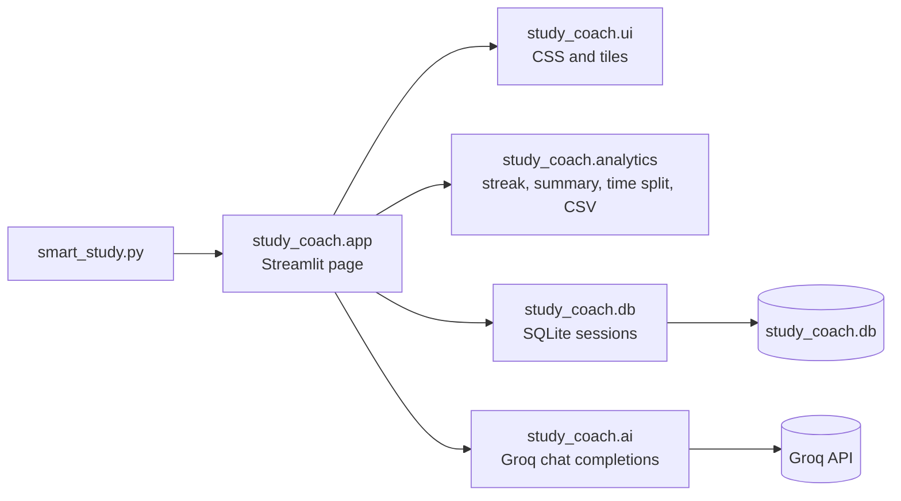

# AI Study Coach

A Streamlit app that turns a list of subjects and a study window into a time-blocked plan, then tracks focus and streaks over time.

[](https://github.com/saumya-st/STUDY-ASSIS/actions)
[](pyproject.toml)
[](LICENSE)

## What it is

AI Study Coach is a single-page study planner. Enter subjects, set a priority for each, pick a start and end time, and the app asks a Groq-hosted LLM for a schedule that fits the window, followed by short feedback on the plan. Logged sessions are stored in SQLite and drive a streak counter, summary metrics and a focus trend chart.

## Live demo

https://stae-study.streamlit.app

<!-- TODO: make the app public in Streamlit Cloud settings -->

### Screenshots

<!-- TODO: add docs/screenshots/plan.png (generated plan with time distribution chart) -->
<!-- TODO: add docs/screenshots/history.png (metrics row, session history and focus trend) -->

## Key features

- Time-blocked schedule generated from subjects, per-subject priority (1 to 5) and a start/end time
- AI feedback on the generated plan: one strength, one improvement, one tip
- Session logging with a 1 to 10 focus score
- Metric tiles for current streak, sessions logged, average focus and total hours
- Streak counted as consecutive days with a logged session, ending today
- Time distribution bar chart showing how hours split across subjects by priority
- Session history table with CSV export
- Focus score trend line chart (daily average)

## Tech stack

| Layer | Choice |
| --- | --- |
| UI | Streamlit (custom CSS, light pink theme) |
| LLM | Groq chat completions API via `requests` (default model `openai/gpt-oss-120b`) |
| Data | SQLite through the standard library `sqlite3`, pandas for aggregation |
| Config | `python-dotenv` for `.env`, Streamlit secrets as fallback |
| Quality | pytest, ruff, GitHub Actions |

## Architecture



`smart_study.py` stays at the repository root because Streamlit Community Cloud runs that file. Everything else lives in the `study_coach` package: `analytics` holds pure functions that are unit tested without Streamlit, `db` and `ai` are the two side-effecting layers, and `app` wires them into the page. `ai` raises `GroqError` rather than rendering errors itself, so the UI decides how to show failures.

## Getting started

Requirements: Python 3.11 or newer and a Groq API key from [console.groq.com](https://console.groq.com).

```bash
git clone https://github.com/saumya-st/STUDY-ASSIS.git
cd STUDY-ASSIS
python -m venv .venv
# Windows: .venv\Scripts\activate    macOS/Linux: source .venv/bin/activate
pip install -r requirements.txt
cp .env.example .env            # then paste your key into GROQ_API_KEY
streamlit run smart_study.py
```

The app opens at http://localhost:8501. The SQLite file is created on first run.

## Configuration

| Variable | Default | Purpose |
| --- | --- | --- |
| `GROQ_API_KEY` | (none, required) | Groq API key. Read from the environment first, then `st.secrets`. |
| `GROQ_MODEL` | `openai/gpt-oss-120b` | Groq model id used for both plan generation and feedback. |
| `STUDY_DB_PATH` | `study_coach.db` | Path to the SQLite database file. |

On Streamlit Cloud, set `GROQ_API_KEY` (and optionally `GROQ_MODEL`) in the app's Secrets panel; see `.streamlit/secrets.toml.example`.

## Testing and CI

```bash
pip install -r requirements-dev.txt
ruff check .
ruff format --check .
pytest
```

The suite covers streak edge cases, the metrics summary, the proportional time split, CSV export, a SQLite round-trip against a temporary database, Groq error handling with `requests` mocked, and headless renders of the full page using Streamlit's `AppTest`. The GitHub Actions workflow runs the same commands on Python 3.11 and 3.12 for every push and pull request.

## Docker

```bash
docker build -t study-coach .
docker run -p 8501:8501 -e GROQ_API_KEY=your_key -v study-data:/data study-coach
```

The image uses `python:3.12-slim` and stores the database on a `/data` volume. Docker was not available when the Dockerfile was written, so it has not been built or run yet.

## Design decisions and trade-offs

- **SQLite.** Zero configuration and a single file, which suits a one-person local tool. On Streamlit Cloud the filesystem is ephemeral, so data resets on redeploy, and because there is no authentication every visitor shares the same table.
- **LLM-generated schedule text.** The model writes the schedule as free text given the window, priorities and break rules. Output is non-deterministic and is only loosely checked; the app does not parse or validate the times it returns.
- **Groq.** Chosen for low-latency inference on open-weight models with an OpenAI-compatible API, which keeps the integration to a single `requests.post`.
- **Streak from distinct dates.** The streak shown in the UI is recomputed from the distinct session dates each time. The `streak` column written on save is kept for backward compatibility with existing databases but is not used for display.

## Future work

- Per-user authentication so histories are not shared
- Persistent database (Postgres or Supabase) for the hosted version
- Structured JSON schedule output with validation of times and totals
- Calendar export (ICS)
- Pomodoro timer tied to the generated blocks

## License

MIT. See [LICENSE](LICENSE).

## Author

Saumya Tiwari ([GitHub](https://github.com/saumya-st), [Portfolio](https://saumya-tiwari.vercel.app), [LinkedIn](https://www.linkedin.com/in/saumya-tiwari-22909a330))
